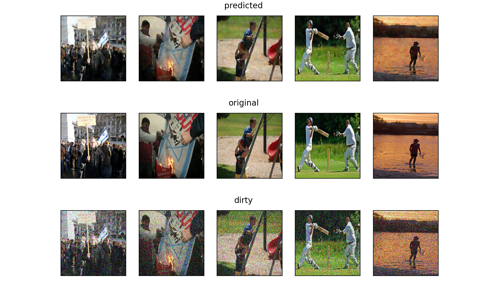
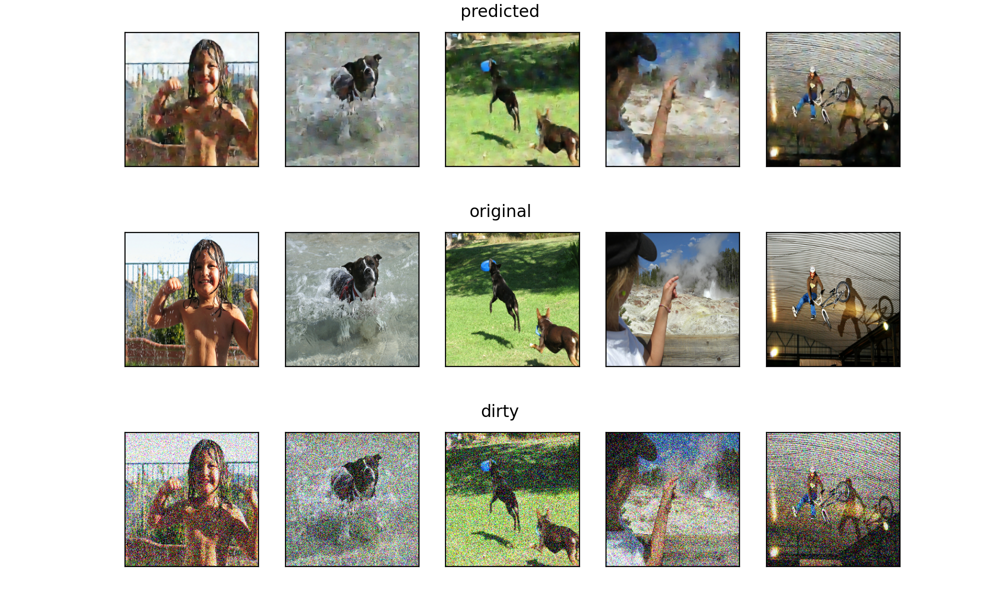

# Image Denoising

## Presentation

This is a Computer Vision task which consists, having a noisy image to restore it in order to make it more usable. The noise present in the image can be due to various factors which are often impossible to avoid (noise produced by a sensor taking the image for example). This task is therefore particularly useful in areas where the quality of the original image is extremely important. We can cite among others:

* Image restoration
* Image classification
* Visual tracking

## Dataset

The realized code here is done on the FlickR8K Dataset (downloadable here https://www.kaggle.com/adityajn105/flickr8k/download). It is a dataset containing about 8000 images with their corresponding captions (5 captions per image.).

Our data is composed of pairs of (X,y) where X represents the noisy image and y the clean image.

X is created from y by adding gaussian noise on y.

At the end the dataset is divided into a training, a test and a validation set with the following corresponding percentages : 80/10/10.

Before using the dataset on the model, it has been normalized to speed up the convergence.

## Configuration

To run the project you just need to modify the paths **images_path** and **captions_path** to put respectively the path of **captions.txt**  and Images in the dataset folder

## Model

Our model takes a noisy image as input and generates the clean version of that image. One of the best types of models for this type of task is **Auto Encoders**.

For our model we implemented one of the state of the art models for **Image Denoising** application : **PRIDNet** (https://arxiv.org/abs/1908.00273).

**PRIDNet** 

## Training

The model has been trained with the following parameters and hyperparameters:

* Loss function: **MSE** loss.
* Optimizer: **Adam** optimizer with an initial learning rate of **0.001**.
* Callbacks:
  * **ReduceLROnPlateau** which divides the learning rate by 5 each time the loss of the model starts to stagnate (with a patience of 5 epochs).
  * **EarlyStopping** which is used to stop training when the model starts to overfit.
* The model has been trained on 130 epochs

## Evaluation

### Presentation of metrics

In the field of image denoising, we compare the performance of a model using different metrics:

* **Mean Squared Error (MSE)** which consists in calculating the square root of the difference between the predicted matrix and the real matrix.
* **Peak Signal to Noise Ratio (PSNR)** which is a measure of distortion used in digital images and which makes it possible to quantify the performance of the reconstruction of the model. However, it is important to note that while the PSNR is useful for measuring the proximity of the compressed image to the original at the signal level, the latter does not take into account the visual quality of reconstruction and therefore cannot be considered as an objective measure of the visual quality of an image.

There are still several other measures of similarity between images such as **SSIM** (Structural Similarity).

### Results

The evaluation of our model on Mean Squared Error has gave the result of **0.51**. The evaluation of the PSNR and SSIM has not yet been done.

## Results

Below are some results:

## Observations and improvements

We can observe that the model is generating clearer images from the noisy ones. However when looking closer, we observe that the generated images have lost details.

To improve the results the following modifications can be done:

* increase the size of channel attention layers (part of the PRIDNet architecture) to capture more information from the images before passing it to the Multi-Scale Feature Extraction Module (heart of the PRIDNet architecture) .
* Train further